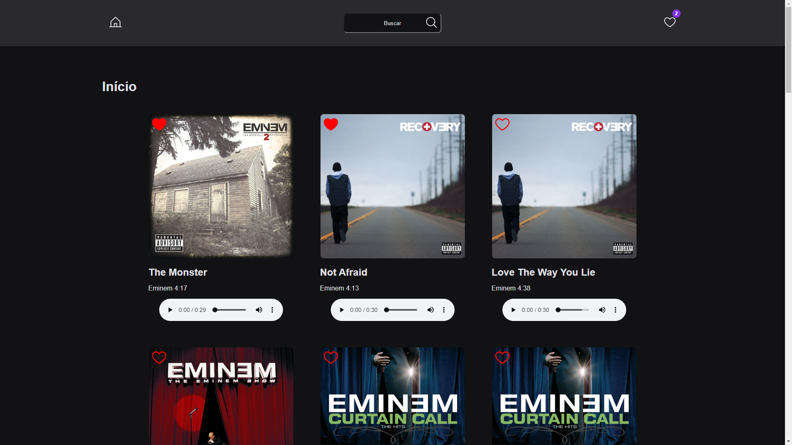

<h1 align="center"> Deezer API </h1>

<p align="center">
  Bem-vindo ao projeto Deezer API!<br/>
</p>

<p align="center">
  <a href="#-tecnologias">Tecnologias</a>&nbsp;&nbsp;&nbsp;|&nbsp;&nbsp;&nbsp;
    <a href="#-instalacao-do-projeto">Instalação do projeto</a>&nbsp;&nbsp;&nbsp;|&nbsp;&nbsp;&nbsp;
  <a href="#-sobre-o-projeto">Sobre o Projeto</a>&nbsp;&nbsp;&nbsp;

</p>

<p align="center">
  
</p>

## 🚀 Tecnologias <br id="-tecnologias">

Esse projeto foi desenvolvido com as seguintes tecnologias:

- Typescript
- React
- Styled Components
- React Query
- Zod
- Phosphor Icons
- React Hook Form
- Context API
- Deezer API
- React Router Dom

## ⚙️ Instalação do projeto <br id="-instalacao-do-projeto">

### Passo-a-passo:

#### 1. Clone o repositório para o seu computador usando o seguinte comando:

```bash
git clone git@github.com:andr3felipe/deezer-api.git
```

#### 2. Navegue até o diretório do projeto:

```bash
cd deezer-api
```

#### 3. Instale as dependências do projeto:

```bash
npm install
# or
yarn
```

#### 3. Inicie um servidor de desenvolvimento:

```bash
npm run dev
# or
yarn dev
```

## 💻 Sobre o Projeto <br id="-sobre-o-projeto">

Este projeto tem como objetivo consumir a API do Deezer, você pode fazer busca por músicas, e adicioná-las aos favoritos.
